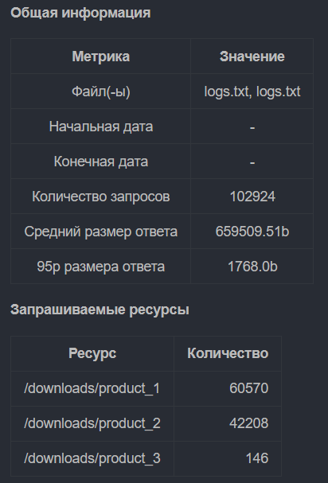
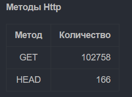
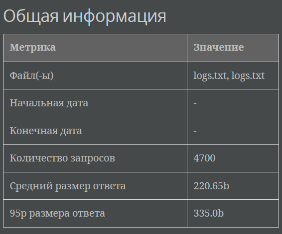
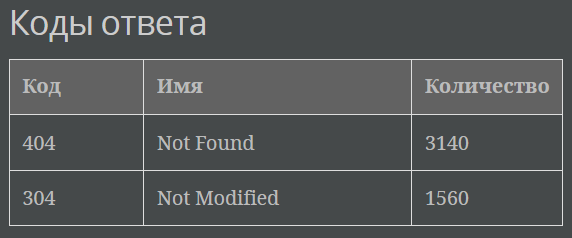

# Log Analyzer

## Описание

**Log Analyzer** — это консольное приложение для анализа логов NGINX. Оно позволяет фильтровать, обрабатывать и выводить
статистику из лог-файлов с учетом указанных параметров.

## Возможности

Программа анализирует логи и предоставляет следующие виды статистики:

1. **Общая информация**  
   Показывает общее количество запросов, объем переданных данных и диапазон дат в логах.

2. **Топ запрашиваемых ресурсов**  
   Отображает самые часто запрашиваемые ресурсы с количеством запросов для каждого.

3. **Топ кодов ответа**  
   Указывает, какие HTTP-коды ответов встречались чаще всего.

4. **Топ методов HTTP**  
   Анализирует и выводит наиболее используемые HTTP-методы (например, GET, POST).

5. **Топ IP-адресов**  
   Показывает IP-адреса с наибольшим количеством запросов.

## Доступные параметры

|    Флаг    |                                               	Описание	                                                |                    Пример                     |
|:----------:|:-------------------------------------------------------------------------------------------------------:|:---------------------------------------------:|
|  `--path`  |                          	Путь до файла с логами или URL. Параметр обязателен.                          |        	`--path /path/to/logfile.log`         |
|  `--from`  |                     Указывает начальную дату для анализа (в формате `yyyy-MM-dd`).                      |              `--from 2024-01-01`              |
|   `--to`   |                      Указывает конечную дату для анализа (в формате `yyyy-MM-dd`).                      |               `--to 2024-12-31`               |
| `--format` | Формат вывода статистик. Возможные значения: `md` (Markdown) или `adoc` (AsciiDoc). По умолчанию: `md`. |                `--format adoc`                |
| `--filter` |  Указывает критерии фильтрации в формате `field:value`. Поддерживает несколько фильтров через пробел.   | `--filter ip:192.168.0.1` `--filter code:200` |

## Поля фильтрации

|     Поле      |       	Формат ввода        |
|:-------------:|:--------------------------:|
|     `ip`	     |      `ip:<IP-адрес>`       |
|    `user`     | 	`user:<имя пользователя>` |
|    `date`	    |       `date:<дата>`        |
|   `method`    |   	`method:<HTTP-метод>`   |
|  `resource`   |    	`resource:<ресурс>`    |
|  `protocol`   |   	`protocol:<протокол>`   |
|    `code`	    |     `code:<HTTP-код>`      |
| `bytes_size`	 |   `bytes_size:<размер>`    |
|   `referer`   |    	`referer:<реферер>`    |
|   `agent`	    |    `agent:<User-Agent>`    |

## Вывод статистики

### Markdown (md)

### AsciiDoc (adoc)

